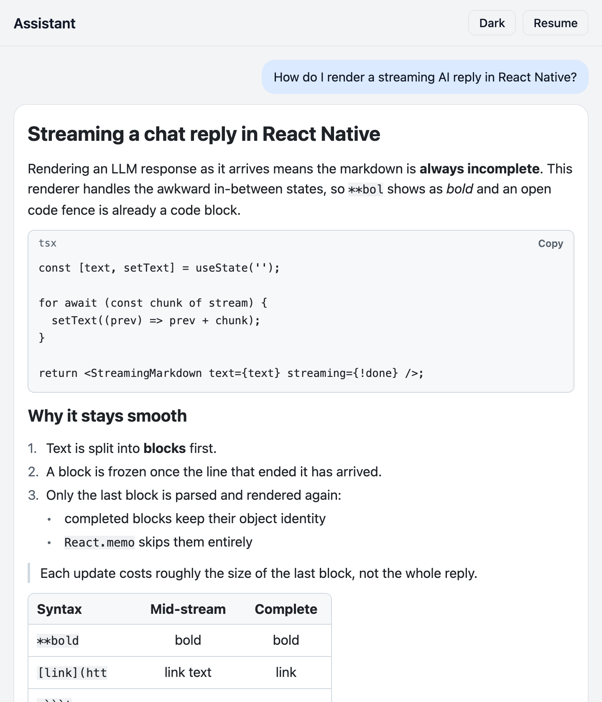
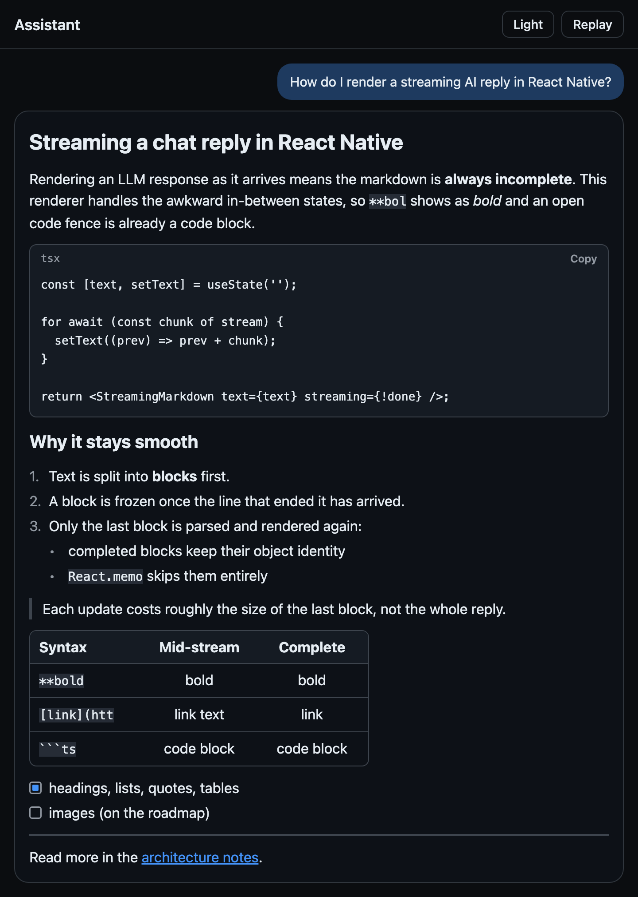

# react-native-streaming-markdown

Markdown for React Native that renders LLM output while it streams: no flicker, no raw `**`, and no re-parsing of the whole reply on every token.

[](https://github.com/OwaisMunawar/react-native-streaming-markdown/actions/workflows/ci.yml)
[](LICENSE)


<p align="center">
  
  
</p>
<p align="center"><sub>The Expo example running on web: mid-stream (left) and complete in dark mode (right). Captured from <code>expo export --platform web</code>.</sub></p>

## Why

General-purpose markdown renderers assume the document is finished. In a chat UI it isn't finished until the last token arrives, and that shows:

- **Flicker.** `**bol` renders as literal asterisks, then snaps to bold when `**` arrives. Half a code fence shows three backticks, a table header shows pipes, a link shows `[text](htt`.
- **Wasted work.** Each token triggers a full parse and a full re-render. Streaming a 5k-token reply token by token is quadratic work, and the whole message tree re-renders on every update.

This library splits the text into blocks, freezes blocks that can no longer change, and re-parses only the one that is still growing. Frozen blocks keep their object identity, so `React.memo` skips them. The growing block is parsed leniently: unclosed syntax renders the way it will look once complete. See [docs/ARCHITECTURE.md](docs/ARCHITECTURE.md) for how it works and which alternatives were rejected.

## Install

```sh
npm install @owaismunawar/react-native-streaming-markdown
```

> The first npm release is being prepared. Until it lands, install straight from GitHub (the `prepare` script builds it):
>
> ```sh
> npm install github:OwaisMunawar/react-native-streaming-markdown
> ```

Pure TypeScript with no native code and no dependencies beyond `react` and `react-native`. Works in Expo Go, bare React Native and React Native Web.

> The unscoped `react-native-streaming-markdown` name on npm belongs to an unrelated package, so this one is scoped.

## Usage

```tsx
import { StreamingMarkdown } from '@owaismunawar/react-native-streaming-markdown';
import * as Clipboard from 'expo-clipboard';

function AssistantMessage({ text, done }: { text: string; done: boolean }) {
  return (
    <StreamingMarkdown
      text={text} // the full text so far, not the latest chunk
      streaming={!done}
      onCopyCode={(code) => Clipboard.setStringAsync(code)}
      onLinkPress={(href) => openInAppBrowser(href)}
    />
  );
}
```

Theming and custom renderers:

```tsx
<StreamingMarkdown
  text={text}
  colorScheme="dark" // defaults to the system scheme
  theme={{ fontSize: 15, colors: { link: '#a78bfa' } }}
  components={{ code: MyHighlightedCodeBlock }}
/>
```

Bring your own renderer with the hook, or parse outside React:

```ts
import {
  createStreamingParser,
  parse,
  useStreamingMarkdown,
} from '@owaismunawar/react-native-streaming-markdown';

const blocks = useStreamingMarkdown(text); // inside a component

const parser = createStreamingParser(); // anywhere
for await (const chunk of stream) {
  acc += chunk;
  const blocks = parser.update(acc); // completed blocks keep their identity
}

parse('# One-off\n\nparse', { streaming: false });
```

Run the example (Expo SDK 57) with `yarn && yarn example start`. It replays a canned reply in token-sized chunks, with pause, replay and a theme toggle.

## API

### `<StreamingMarkdown />`

| Prop          | Type                                       | Default           | Description                                                                                  |
| ------------- | ------------------------------------------ | ----------------- | -------------------------------------------------------------------------------------------- |
| `text`        | `string`                                   | required          | Everything received so far.                                                                  |
| `streaming`   | `boolean`                                  | `true`            | Set to `false` when the reply is complete so trailing unclosed syntax renders literally.     |
| `theme`       | `MarkdownThemeOverride`                    |                   | Partial theme merged over the base theme. `colors` is merged key by key.                     |
| `colorScheme` | `'light' \| 'dark'`                        | system            | Picks `lightTheme` or `darkTheme` as the base.                                               |
| `components`  | `{ code?, heading?, blockquote?, hr? }`    |                   | Replace built-in renderers. Prop types are exported as `CodeBlockProps`, `HeadingProps` etc. |
| `onLinkPress` | `(href: string) => void`                   | `Linking.openURL` | Called when a completed link is pressed. Half-typed links are not pressable.                 |
| `onCopyCode`  | `(code: string, language: string) => void` |                   | Shows a Copy button on code blocks, disabled until the closing fence arrives.                |
| `selectable`  | `boolean`                                  | `true`            | Text selection for paragraphs, table cells and code.                                         |
| `style`       | `StyleProp<ViewStyle>`                     |                   | Container style.                                                                             |

Inline callbacks and object literals are fine: callbacks are read through refs, and `theme` and `components` are compared shallowly, so they don't defeat memoisation.

### Functions

| Export                             | Returns           | Description                                                                 |
| ---------------------------------- | ----------------- | --------------------------------------------------------------------------- |
| `parse(text, { streaming })`       | `Block[]`         | Pure, stateless parse. `streaming` defaults to `true`.                      |
| `createStreamingParser(options)`   | `StreamingParser` | `update(text)` returns blocks, reusing completed ones. `reset()` clears it. |
| `useStreamingMarkdown(text, opts)` | `Block[]`         | Hook around a parser that lives as long as the component.                   |
| `parseInline(text, streaming)`     | `InlineNode[]`    | The inline parser on its own.                                               |
| `inlineToText(nodes)`              | `string`          | Plain text of an inline tree, useful for accessibility labels and search.   |
| `lightTheme`, `darkTheme`          | `MarkdownTheme`   | Default themes.                                                             |
| `mergeTheme(base, override)`       | `MarkdownTheme`   | The merge `StreamingMarkdown` uses.                                         |

Every `Block` has a stable `key`, its `raw` source and `open` (true for the trailing block of a streaming parse). All types are exported.

## Supported syntax

| Syntax                             | Complete input                       | While streaming                                                             |
| ---------------------------------- | ------------------------------------ | --------------------------------------------------------------------------- |
| Headings `#` to `######`           | Yes (ATX)                            | Shown as soon as text follows the hashes; a lone `#` is held back           |
| Paragraphs and hard breaks         | Yes (two trailing spaces or `\`)     | Soft line breaks render as spaces, as in CommonMark                         |
| `**bold**`, `*italic*`, `_italic_` | Yes; `_` is ignored inside words     | `**bol` renders bold; a trailing `**` with nothing after it is hidden       |
| `~~strikethrough~~`                | Yes                                  | Same rules as bold                                                          |
| `` `inline code` ``                | Yes, including multi-backtick spans  | An unclosed span renders as code                                            |
| Links, `<autolinks>`, bare URLs    | Yes, with titles and balanced parens | `[text` and `[text](htt` render as link text, not pressable yet             |
| Images ``               | Rendered as a link to the image      | Same as links                                                               |
| Bullet and ordered lists           | Yes, one nesting level, start number | Only the last item is parsed leniently; a lone `-` or `1.` is held back     |
| Task lists `- [ ]` / `- [x]`       | Yes, with checkbox role and state    | Same as lists                                                               |
| Blockquotes                        | Yes, nested blocks and lazy lines    | Content streams like top-level blocks                                       |
| Fenced code (backticks or tildes)  | Yes, language label and copy hook    | An open fence is already a code block; a half-typed closing fence is hidden |
| GFM tables                         | Yes, alignment and escaped pipes     | The header shows before the delimiter row; partial rows are padded          |
| Horizontal rules                   | `---`, `***`, `___`                  | Held back until the line is complete                                        |

## Benchmarks

`yarn bench` streams a generated document of 20,577 characters (about 5,100 tokens at 4 characters per token, 170 blocks) into the parser **one character at a time**, 20,577 updates, and times each update. It compares `createStreamingParser().update()` with calling `parse()` on the full text every time. Each strategy runs three rounds, and every column is the median across rounds.

Measured on an Apple M2 with Node 23.11:

| Strategy                              | mean / update | p50      | p95      | p99     | max      | total  |
| ------------------------------------- | ------------- | -------- | -------- | ------- | -------- | ------ |
| Incremental (`createStreamingParser`) | 6.4 µs        | 3.3 µs   | 13.7 µs  | 21.1 µs | 639.1 µs | 0.13 s |
| Full re-parse (`parse`)               | 382.3 µs      | 304.4 µs | 811.5 µs | 2.49 ms | 38.17 ms | 7.87 s |

That is about 60x less parse time per update on this document, and the gap grows with length because incremental cost depends on the size of the last block, not the whole reply. This measures parsing only, in Node. On-device JS engines are slower in absolute terms, and the render savings from memoised blocks come on top. Expect a few microseconds of variation between runs.

## Quality

- **64 Jest tests**: 48 parser cases (18 of them partial-stream states), 9 incremental-parser tests and 7 component tests with React Native Testing Library.
- **Equivalence test**: at every prefix of the fixture, and again with uneven chunk sizes, the incremental result must deep-equal a fresh `parse()`.
- **Identity tests**: completed blocks are the same object across appends, and a block whose source didn't change is never rebuilt. A render test checks that completed headings render exactly once while later text streams in, even with inline `components` and callbacks.
- **Coverage thresholds enforced in CI**: 90% of lines overall and 95% on `src/parser` (currently 95.8% and 96.4%).
- **Strict TypeScript** (`strict`, `noUncheckedIndexedAccess`, no `any`), ESLint with zero warnings allowed, and a Prettier check.
- **Bundle budget** with size-limit: 6.4 kB for the component and parser, 3.9 kB for the parser alone (minified and brotlied).
- **Accessibility**: headings use `accessibilityRole="header"` and links use `link`. Task items are checkboxes with checked state, lists and tables have `list`, `table`, `row` and `cell` roles, and the copy button is a labelled `button`.

## Roadmap

- Syntax highlighting as an optional `code` renderer. The `components.code` hook exists, but no highlighter ships yet.
- Images rendered with `Image` instead of as links.
- Deeper list nesting. Anything below the first level is currently flattened into it.
- Setext headings (`===` / `---` underlines), footnotes and HTML blocks.
- Full CommonMark emphasis edge cases, such as `*a **b***`.
- A `link` renderer override, and table cell renderers.
- Benchmarks on Hermes on a device, not only Node.

## License

[MIT](LICENSE)

---

Built by [Owais Munawwar](https://github.com/OwaisMunawar) — available for React Native, AI and iOS work on [Upwork](https://www.upwork.com/freelancers/owaism11).
